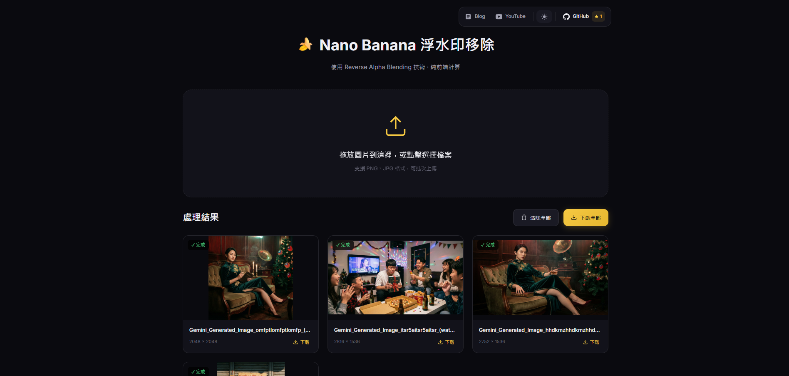

# 🍌 Nano Banana Watermark Remover

使用 **Reverse Alpha Blending** 技術移除 Gemini Nano Banana 浮水印的純前端工具。

[](https://opensource.org/licenses/MIT)



## ✨ 功能特色

- 🔧 **Reverse Alpha Blending** - 使用反向 Alpha 混合演算法還原原始圖片
- 📂 **批次處理** - 支援多張圖片同時上傳處理
- 🎯 **自動偵測** - 根據圖片尺寸自動選擇合適的 mask (48px / 96px)
- ⚡ **強制移除** - 支援手動強制移除功能，解決特殊場景偵測失敗的問題
- 🔒 **隱私保護** - 所有處理皆在瀏覽器本地完成，圖片不會上傳至伺服器
- 📱 **響應式設計** - 支援桌面與行動裝置

## 🚀 使用方式

1. 開啟網頁
2. 拖放或點擊上傳帶有 Nano Banana 浮水印的圖片
3. 等待處理完成
4. (可選)點擊圖片預覽處理後的圖片，並比較與原始圖片的差異
5. 下載處理後的圖片

## 🔬 技術原理

### Alpha Blending (浮水印疊加)
```
Composite = Original × (1 - α) + Watermark × α
```

### Reverse Alpha Blending (浮水印移除)
```
Original = (Composite - Watermark × α) / (1 - α)
```

其中：
- `Composite` = 帶有浮水印的圖片
- `Original` = 原始圖片 (我們要還原的目標)
- `Watermark` = 浮水印圖案 (白色)
- `α` = 浮水印透明度 (從 mask 亮度提取)

## 📁 專案結構

```
NanoBananaWaterMarkRemover/
├── index.html      # 主頁面
├── styles.css      # 樣式表
├── app.js          # 核心邏輯
├── README.md       # 說明文件
└── assets/
    ├── mask_48.png # 48x48 浮水印遮罩
    └── mask_96.png # 96x96 浮水印遮罩
```

## 🛠️ 本地開發

```bash
# 啟動本地伺服器
npx serve .

# 開啟瀏覽器訪問
http://localhost:3000
```

## 聯絡作者

你可以透過以下方式與我聯絡

- [Email: 2.jerry32262686@gmail.com](mailto:2.jerry32262686@gmail.com)
...

## License
This project is under the MIT License. See [LICENSE](https://github.com/ADT109119/NanoBananaWaterMarkRemover/blob/main/LICENSE) for further details.

## Credit

特別感謝以下專案與資源：

- [凱文大叔教你寫程式](https://www.facebook.com/profile.php?id=61564137718583) 的貼文與 [GeminiWatermarkRemove](https://github.com/kevintsai1202/GeminiWatermarkRemove) 專案，提供了製作此專案的靈感
- [gemini-watermark-remover](https://github.com/journey-ad/gemini-watermark-remover) by [journey-ad](https://github.com/journey-ad) - 本專案使用的 mask 圖片來源 (MIT License)